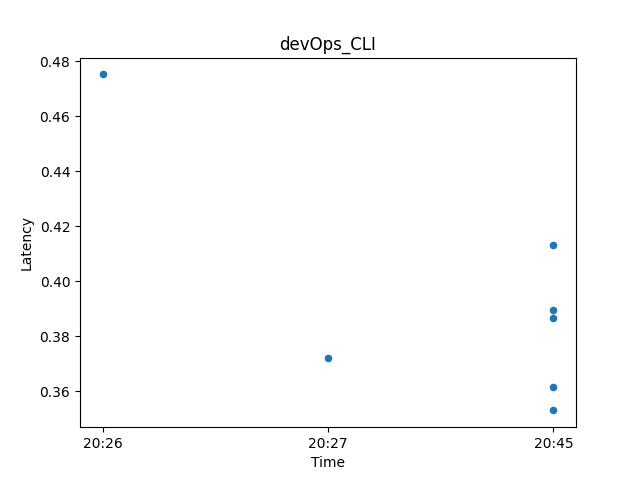

#PROJECT_NAME:    devOps_CLI
#HANDLE:    _MUMINUL__ISLAM___

##**A devOps with CLI Project**
devOps_CLI -Checking Server Health with Logging & Plotting (MVP)

A Very Minimal Server/API Health Checking Module.
Offering CSV Report Generation with Plotting and Logging.

[GitHub] (github_url)

**Key Features**
-Minimal Build.
-CSV,PNG,LOG Output.
-Ping Once Per Run. Delicate to Server Rate Limit.
-Modular. Easily Scalable.
-**CLI** Enabled
-Config Modifiable

**Tech Stack**
-Python Version: 3.12+
-Ping: Requests
-CLI: Argparse
-CSV: CSV Module
-JSON: json Module
-Graph: Pandas,Matplotlib

**Project Version**
-Project_Version: 0.1.0

## Table of Contents
-[Installation]
-[Usage]
-[Screenshot]
-[Author]
-[License]

##Installation

1.Clone the repository
    ~git clone github_url~

2.Install Dependency With Pip
    ~pip install -r requirements.txt~

3.Move Your Working Directory to devOps_CLI Folder
    ~cd to_devOps_CLI_folder~

4.Run From main.py With
    ~python3 -m main~

    For CLI Enable Run:
    ~python3 -m main --output~

##Screenshot

##Author

[MUMINUL ISLAM: _MUMINUL__ISLAM___]
Visit Github Page For More Fun Projects

##License

This Project is **Proprietary** and For **Job Evaluation Purpose Only**
Not to Build to Mimicing any Existing Software/Services.
All Codes From Author.

**config.json used url as reference.put your own url there before use.**
**this app is not intended to violate any terms of service of any url.**

Thank Your For Visiting the Code Base.
[Muminul Islam] [2026]

##References

-[GitHub](github_url)
